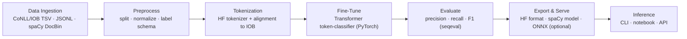

<div align="center">

# ✨ **FictioNER — Named Entity Recognition for Fiction**


Domain-adapted NER for **fiction & narrative text** — detect **characters**, **locations**, **organizations**, and custom literary entities.

</div>

---

## 🧭 Abstract
**FictioNER** is a lightweight, production-friendly pipeline for **Named Entity Recognition** on **fiction**. General-domain NER models struggle with narrative style, epithets, nicknames, and coreference hints. FictioNER fine-tunes transformer encoders on **story-centric annotations** (CoNLL/IOB), adds optional **spaCy** postprocessing, and ships ready-to-run scripts for training, evaluation, and inference.

---

## 🔎 Overview
- **Goal:** robust entity extraction from novels, short stories, scripts, and fan‑fic.
- **Entities (configurable):** `PER`, `LOC`, `ORG`, `GPE`, `FAC`, `VEH` (extend via `config/labels.txt`).
- **Backbones:** Hugging Face Transformers (e.g., `bert-base-cased`, `roberta-base`) with token‑classification heads.
- **Extras:** optional **spaCy** pipeline for sentence segmentation, rule hints, and cleaner spans.

---

## 🔄 Pipeline



---

## 📦 Data
- Accepts **CoNLL/IOB** (`token label` per line, blank line between sentences), **JSONL** span annotations, or **spaCy DocBin**.
- Train/validation/test splits are configurable; stratification by entity presence supported.
- Tips for fiction:
  - Add aliases and epithets to the same **PERSON** id during annotation.
  - Keep punctuation tokenization consistent (quotes, em‑dashes).
  - Consider a small **rules layer** for titles/honorifics (e.g., “Lord”, “Detective”).

> (If you have a public dataset link, drop it here.)

---

## 📈 Results (Validation)
From the final epoch of the run you shared:

| Label | F1 | Precision | Recall | Support |
|---|---:|---:|---:|---:|
| **PER** | **0.8298** | 0.8128 | 0.8476 | 932 |
| **GPE** | 0.7895 | 0.7500 | 0.8333 | 144 |
| **FAC** | 0.6933 | 0.6783 | 0.7091 | 220 |
| **ORG** | 0.5455 | 0.5000 | 0.6000 | 5 |
| **LOC** | 0.5111 | 0.4742 | 0.5542 | 83 |
| **VEH** | 0.5714 | 0.5000 | 0.6667 | 12 |

**Aggregates**  
- **Micro F1:** **0.7807** (P=0.7583, R=0.8044, N=1396)  
- **Macro F1:** 0.6568  
- **Weighted F1:** 0.7820

> *Note:* Micro F1 was used as the checkpoint selection criterion in this run.

---

## ⚙️ Installation

```bash
git clone https://github.com/AnfalAlkuraydis/FictioNER.git
cd FictioNER

# (optional) create a virtual env
python -m venv .venv
# Windows:
.venv\Scripts\activate
# macOS/Linux:
source .venv/bin/activate

pip install -r requirements.txt
```

---

<div align="center">
Made with ❤️ — bringing NER to the world of fiction.
</div>
