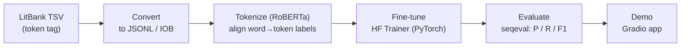

<div align="center">

# FictioNER 📖  
Fine-tuned [RoBERTa](https://huggingface.co/roberta-base) for Named Entity Recognition (NER) on the [LitBank](https://github.com/dbamman/litbank) dataset.


</div>

---

## 📌 Project Overview
This project trains a RoBERTa-based NER model to detect literary entities such as:

- **PER** – Persons  
- **GPE** – Geo-political entities  
- **LOC** – Locations  
- **FAC** – Facilities  
- **ORG** – Organizations  
- **VEH** – Vehicles  

### What’s inside
1. Parse LitBank TSV annotations  
2. Convert to JSONL / IOB labels  
3. Tokenize & align labels with **RoBERTa**  
4. Fine-tune using **PyTorch + Hugging Face Transformers**  
5. Evaluate with **seqeval**  
6. Serve an interactive **Gradio** demo  

---

## 🔄 Pipeline



---

## 🚀 Results
Training progressed smoothly and validation improved each epoch.

- Train loss ≈ **0.31 → 0.15 → 0.11**  
- Val F1 ≈ **0.74 → 0.77 → 0.78**  
- Test (overall) **F1 ≈ 0.77**, **Macro-F1 ≈ 0.65**

### Per-label (validation snapshot)
| Label | F1 | Precision | Recall | Support |
|---|---:|---:|---:|---:|
| **PER** | **0.8298** | 0.8128 | 0.8476 | 932 |
| **GPE** | 0.7895 | 0.7500 | 0.8333 | 144 |
| **FAC** | 0.6933 | 0.6783 | 0.7091 | 220 |
| **ORG** | 0.5455 | 0.5000 | 0.6000 | 5 |
| **LOC** | 0.5111 | 0.4742 | 0.5542 | 83 |
| **VEH** | 0.5714 | 0.5000 | 0.6667 | 12 |

**Aggregates:** Micro-F1 **0.7807**, Macro-F1 **0.6568**, Weighted-F1 **0.7820**.

> **Notes:** PER is strongest (rich supervision). ORG is weakest (very few examples).  

---

## 🛠️ Installation
```bash
git clone https://github.com/AnfalAlkuraydis/FictioNER.git
cd FictioNER
pip install -r requirements.txt
```

---

## ▶️ Quickstart

### Train
```bash
python src/train.py \
  --train data/train.conll \
  --dev data/dev.conll \
  --labels config/labels.txt \
  --model_name roberta-base \
  --output_dir models/roberta-fic-ner \
  --epochs 3 --batch_size 16 --lr 3e-5
```

### Evaluate
```bash
python src/evaluate.py \
  --test data/test.conll \
  --labels config/labels.txt \
  --model_dir models/roberta-fic-ner
```

### Inference (CLI)
```bash
python src/infer.py \
  --text "Arya met the Faceless Man in Braavos near the House of Black and White." \
  --model_dir models/roberta-fic-ner
```

### Inference (Python)
```python
from transformers import AutoTokenizer, AutoModelForTokenClassification, pipeline
model_dir = "models/roberta-fic-ner"
tok = AutoTokenizer.from_pretrained(model_dir)
model = AutoModelForTokenClassification.from_pretrained(model_dir)
ner = pipeline("token-classification", model=model, tokenizer=tok, aggregation_strategy="simple")
ner("The White Witch ruled Narnia from Cair Paravel.")
```

---

## 🎛️ Gradio Interface


### Example Flagged Data


---

## 🧰 Project Structure (suggested)
```
FictioNER/
├─ src/
│  ├─ train.py          # fine-tuning script
│  ├─ evaluate.py       # metrics with seqeval
│  ├─ infer.py          # CLI inference
│  ├─ data_utils.py     # readers (CoNLL, JSONL) & aligners
│  └─ app_gradio.py     # demo
├─ config/
│  ├─ labels.txt
│  └─ params.yaml       # optional
├─ data/
│  ├─ train.conll
│  ├─ dev.conll
│  └─ test.conll
├─ models/
│  └─ roberta-fic-ner/
├─ assets/
│  ├─ gradio.PNG
│  └─ flags.PNG
└─ requirements.txt
```

---

## 📜 License
Released under the **MIT License**.

---

<div align="center">
Made with ❤️ — bringing NER to the world of fiction.
</div>
